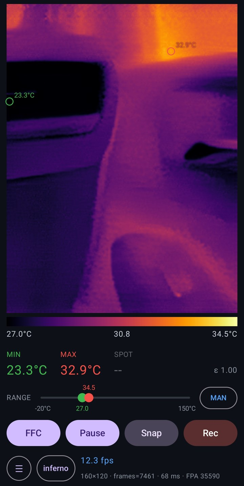

<div align="center">

# 🔥 MAG160 ThermalCam

### Your Magnity thermal camera, reborn on modern Android.

**English** · [繁體中文](README.zh-TW.md) · [简体中文](README.zh-CN.md)


</div>

<p align="center"></p>

---

## 😤 The problem

The Magnity **MAG-Mx / MAG-Cx** USB thermal camera (VID `0x833C`) is great hardware — but its
official apps **stopped working on Android 15+**. Plug it into a new phone and you get
nothing.

## 💡 The fix

**MAG160 ThermalCam** is a brand-new Android app for this camera, rebuilt from the ground up
by reverse-engineering the vendor SDK. Plug in, open, measure. On the phone you already own.

## ✨ Android app features

| | |
|---|---|
| 📱 **Works on Android 15+** | Runs where the factory MAG-Cx / MAG-Mx apps no longer do. |
| 🌡️ **Real absolute temperature** | Straight from the factory SDK — fully corrected, no manual calibration. |
| 🎯 **MIN / MAX / SPOT markers** | Find the hottest and coldest point instantly, plus a live colour bar and range. |
| 🎚️ **Adjustable emissivity** | Set ε from 0.10 to 1.00, with one-tap presets for skin, matte paint and wood. |
| 🚀 **4× AI super-resolution** | A thermal-tuned Real-ESRGAN model on the GPU via **ncnn + Vulkan** turns 160×120 into a crisp 640×480. |
| ✨ **Anime4K GPU upscaling** | Sharp, clean display with a real-time CNN shader. |
| 📸 **Snapshots** | One tap saves a PNG. |
| 🎬 **Video recording** | Hardware **HEVC/H.265** encoding with automatic H.264 fallback. |
| 🌡️ **Temperature captures** | Snapshots and recordings can also save a `.mgt` file holding every pixel's °C — reopen it in the app and read any position, in any frame. |
| 🔀 **Visible-light fusion (beta)** | Overlay the phone camera's edges on the thermal image (MSX-style), blend, or search in the wide visible view — with alignment calibrated at several distances, auto distance from centre-weighted lens focus (with a crosshair showing the patch it measures), and calibration export/import. |
| 📍 **Optional geo-tag** | Stamp precise GPS location into snapshots and videos — off until you turn it on. |
| 💾 **Remembers your setup** | Palette, range, rotation, upscaler, emissivity and more survive restarts. |
| 🚫 **No watermark** | Your images are yours. |
| 👍 **Compact portrait UI** | Designed for one-handed use in the field. |

## 🚀 Get started

1. **Download the APK** from [Releases](https://github.com/delphicchen/MAG160_ThermalCam/releases) (arm64, Android 13+), or build it yourself:
   ```sh
   cd android2
   JAVA_HOME=/path/to/android-studio/jbr ./gradlew :app:assembleDebug
   ```
2. Connect the camera to your phone with a **USB-C OTG adapter**.
3. Open the app, accept the USB permission — you're streaming.

> **Note:** the vendor SDK (`libcoresdk.so` / the AAR files under `android2/lib/`) is **not**
> included in this repository. Supply it from your own copy of the vendor software.

## 🧰 Also in this repository

- **🐧 Linux desktop viewer** (`viewer.py`) — live 160×120 @ 15 fps in pure Python, bit-exact
  factory NUC, flat-field / bad-pixel / denoise pipeline, Planck-based °C readout.
  Quick start:
  ```bash
  pip install pyusb numpy pillow PySide6 matplotlib
  sudo cp 99-magnity-thermal.rules /etc/udev/rules.d/ && sudo udevadm control --reload-rules
  python3 viewer.py
  ```
- **🧠 Train your own thermal SR model** — a Colab pipeline in [`sr_train/`](sr_train/README.md).
- **🔬 Reverse-engineering notes** — the full USB protocol in [`PROTOCOL.md`](PROTOCOL.md) and
  the SDK / calibration write-up in
  [`android2/REVERSE_ENGINEERING.md`](android2/REVERSE_ENGINEERING.md).
- **`android/`** — an earlier Android port that runs the fully open, SDK-free pipeline.

## 📜 Licence

**Free for noncommercial use** — personal, research, educational and hobby use. Commercial use
needs a separate written licence; see [`LICENSE`](LICENSE). Third-party components keep their
own terms ([`android2/THIRD_PARTY_NOTICES.md`](android2/THIRD_PARTY_NOTICES.md)). The Magnity /
Elo SDK is proprietary and is neither licensed nor redistributed here.

Temperature readings are informational only; this is not a calibrated instrument.

## ⭐ Brought your camera back to life?

**Give the repository a star** — it's how I decide whether to keep polishing it.
Issues and pull requests are welcome.

---

## 🔗 友鏈

**友鏈:** [https://linux.do](https://linux.do)

非常感谢 LINUX DO 社区提供的交流平台 / Many thanks to the LINUX DO community for the great discussion platform.
